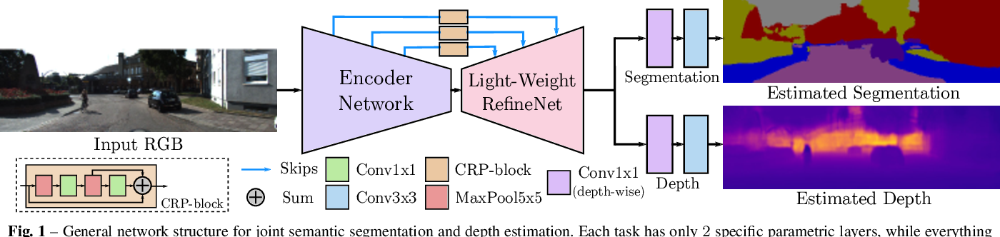

# Multi Task Learning: Semantic Segmentation and Depth Estimation Using a Single Network


This project aims to create a model that performs semantic segmentation and monocular depth estimation simultaneously. Semantic segmentation is the process of classifying each pixel in an image into one of several predefined classes (e.g., road, building, car), while depth estimation focuses on predicting the depth information (distance from the camera) for each pixel in the image. Combining these tasks into a single model opens up exciting possibilities for understanding the 3D world from 2D images.

We will create the model architecture from scratch. We willl provide the step-by-step instructions, code, and resources to guide you through the process of implementing this model from the ground up.

## Table of Contents

1. [Introduction](#introduction)
2. [Getting Started](#getting-started)
   - [Prerequisites](#prerequisites)
   - [Installation](#installation)
3. [Project Structure](#project-structure)
4. [Training](#training)
   - [Data Preparation](#data-preparation)
   - [Model Configuration](#model-configuration)
   - [Training Process](#training-process)
5. [Inference](#inference)
6. [Performance Tuning](#performance-tuning)

## 1. Introduction

The ability to perform both semantic segmentation and depth estimation in real-time has applications in autonomous driving, robotics, augmented reality, and more. This project aims to provide a practical and accessible implementation of a multi-task network capable of handling these tasks simultaneously.

### 1.1. A brief explanation of the Model

Multi-task learning (MTL) is a deep learning paradigm where a single neural network model is trained to perform multiple related tasks simultaneously. This approach is beneficial in scenarios where the tasks share some common underlying features or representations. Segmentation and depth estimation are two such tasks that can benefit from MTL.

The model architecture consists of an encoder decoder network with skip connections, and it has two head: one for segmentation and another for depth estimation. This approach reduces the computational cost and memory requirements compared to training two independent models.



Visit this [paper](https://arxiv.org/abs/1809.04766) for a more detailed technical explanation of the model.

## 2. Getting Started

### 2.1. Prerequisites
Before you begin, make sure you have the following prerequisites installed:

- Python 3
- Pytorch
- NumPy
- OpenCV
- PIL

### 2.2. Installation

1. Clone this repository to your local machine:

   ```bash
   git clone https://github.com/arief25ramadhan/segmentation-with-depth-estimation.git
   ```

2. Navigate to the project directory:

   ```bash
   cd segmentation-with-depth-estimations
   ```

3. Install the required Python packages:

   ```bash
   pip install -r requirements.txt
   ```

### 2.3. Data Preparation

1. Download the NYUD V2 dataset and annotations by running this command on your terminal. This dataset is based on Jeremy Cohen's [hydranet repository](https://github.com/Jeremy26/hydranets_course/blob/main/MTL_Train_Home.ipynb).


```
wget https://hydranets-data.s3.eu-west-3.amazonaws.com/hydranets-data-2.zip && unzip -q hydranets-data-2.zip && mv hydranets-data-2/* . && rm hydranets-data-2.zip && rm -rf hydranets-data-2
```


2. Organize your dataset in the following directory structure:

   ```
   dataset/
   |-- nyud
       |-- depth/          # Contain depth images
       |-- masks/          # Contain segmentation images
       |-- rgb/            # Contain rgb images
   ```


## 3. Project Structure

```
|-- dataset/                 # Folder containing data files
|-- model/                   # Folder containing model files
|-- train.py                 # Training script
|-- dataset.py               # Script to load dataset
|-- loss.py                  # Script to load loss function
|-- utils.py                 # Script containing helper functions
|-- config.py                # Script containing hyperparameters
|-- model.py                 # Script to load model
|-- inference.py             # Script to perform inference
```


## 4. Training

Training this architecture from scratch requires model configuration, and the training process itself.

### 4.1. Model Configuration

Configure the model architecture in the `model.py` file.

### 4.2. Training Process

Run the training script to start training:

```bash
python train.py
```

## 5. Inference

After training your model, you can perform inference on images.

```bash
python inference.py
```

## 6. Performance Results

After training the model for 10 epochs, we look at the model's performance qualiatively and quantitatively. Figure below shows some of the inference results of our model. We can see that the model does mispredicted. This project is only for learning. So, creating the most accurate model, which requires a lot of tuning and training, is not our priority.

<!-- 
 -->

## 7. Acknowledgement

### 7.1. The Original Paper
The implementation is based on the [Real-Time Joint Semantic Segmentation and Depth Estimation Using Asymmetric Annotations
](https://arxiv.org/abs/1809.04766) paper by Vladimir Nekrasov, Thanuja Dharmasiri, Andrew Spek, Tom Drummond, Chunhua Shen, and Ian Reid.

#### Abstract
Deployment of deep learning models in robotics as sensory information extractors can be a daunting task to handle, even using generic GPU cards. Here, we address three of its most prominent hurdles, namely, i) the adaptation of a single model to perform multiple tasks at once (in this work, we consider depth estimation and semantic segmentation crucial for acquiring geometric and semantic understanding of the scene), while ii) doing it in real-time, and iii) using asymmetric datasets with uneven numbers of annotations per each modality. To overcome the first two issues, we adapt a recently proposed real-time semantic segmentation network, making changes to further reduce the number of floating point operations. To approach the third issue, we embrace a simple solution based on hard knowledge distillation under the assumption of having access to a powerful `teacher' network. We showcase how our system can be easily extended to handle more tasks, and more datasets, all at once, performing depth estimation and segmentation both indoors and outdoors with a single model. Quantitatively, we achieve results equivalent to (or better than) current state-of-the-art approaches with one forward pass costing just 13ms and 6.5 GFLOPs on 640x480 inputs. This efficiency allows us to directly incorporate the raw predictions of our network into the SemanticFusion framework for dense 3D semantic reconstruction of the scene.

```
@misc{nekrasov2019realtime,
      title={Real-Time Joint Semantic Segmentation and Depth Estimation Using Asymmetric Annotations}, 
      author={Vladimir Nekrasov and Thanuja Dharmasiri and Andrew Spek and Tom Drummond and Chunhua Shen and Ian Reid},
      year={2019},
      eprint={1809.04766},
      archivePrefix={arXiv},
      primaryClass={cs.CV}
}
```

### 7.2. The Code 

This project is for learning purposes and made by following the steps in [thinkautonomous.ai](https://www.thinkautonomous.ai/) Hydranet's course. We also use sources from these repository:
- https://github.com/Jeremy26/hydranets_course
- https://github.com/DrSleep/multi-task-refinenet
